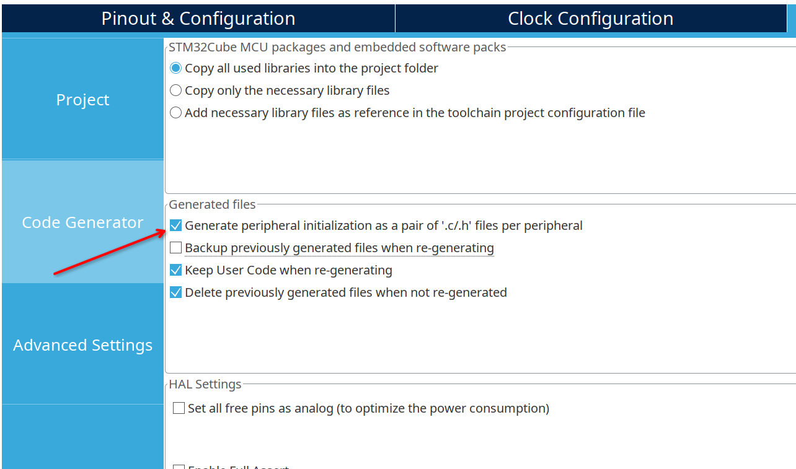

STM32 Nucleo-F446RE LVGL9 Test Project
======================================

Testing LVGL9 with STM32 Nucleo-F446RE demoboard.

Based on Drivers and LVGL porting by Kevin Fox (kpf5297)
https://github.com/kpf5297/ILI9341-TFT-LVGL

# Configure the project

I followed the steps described in:
https://github.com/kpf5297/ILI9341-TFT-LVGL/blob/main/README.md

Just some notes and variations:

- used SPI2 (TFT) and SPI3 (TP) because SPI1 is already used in default Nucleo configuration
- changed names of GPIO in CubeMX to clearify if used by tft or touch panel. So need to adjust the board definition file
- changed option in CubeMX code generator tab, to create .c/.h individual files, imported in tft and tp drivers 
- added driver .c/.h files to Makefile directly, since at the moment I don't use CMake
- created my custom board file for TFT+TP to use SPI2/SPI3 and custom labels: `Drivers/ILI9341-TFT-LVGL/Board/boards/board_stm32f446_it.h` and included it in `board_config.h`
- included `lvgl.mk` to `Makefile` and added `$(CSRCS)` to sources list to compile lvgl library
- created a stub in `freertos.c` for `osThreadDetach()` [1]

